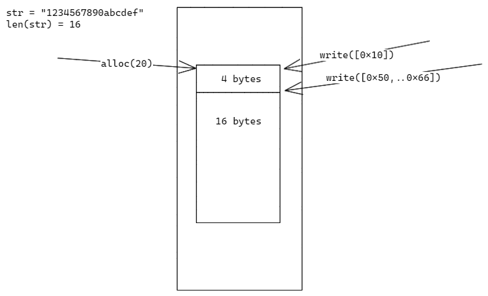

# 函数

我们的函数是通过运行在 Wasmtime 之上的，所以这里的函数指的不是我们编写的业务处理代码，而是将代码编译处理得到的 wasm 文件。理论上我们可以用任何支持 wasm 的编程语言来编写处理代码。


## 关于函数的一些约定

*具体实现请查阅 wasm 模块代码*

这是我们规定的函数签名，函数名为 `event_handler_entry`，参数和返回值各一个，都是32位无符号整型；

```go
//export event_handler_entry
func EventHandlerEntry(p *uint32) uint32 {
    //
}
```

目前 Wasmtime 只支持传递基础类型的参数，所以我们想要传递复杂参数就得绕个弯去实现。

- [Pass complex parameters to Wasm functions](https://wasmedge.org/book/en/sdk/go/memory.html)

简单总结下就是：
1. 首先调用内存分配函数分配内存，拿到内存地址
2. 往这块内存写入参数
3. 调用我们自己的函数（如`event_handler_entry`），传入上面的内存地址
4. 在我们的函数中通过地址反推得到参数，执行业务代码
5. 函数的结尾将需要返回对象的指针返回
6. 函数返回后，通过返回的指针反推得到执行结果

> 注意在上述过程中执行环境会在 Host 环境和 Wasm 环境来回切换。

如何根据参数指针反推出完整参数？

我们在分配内存时多申请4byte，前4byte固定用来保存参数大小，如图：



当然作为用户是不需要了解这些东西的，我们已经为部分编程语言实现了这些业务无关的代码，用户只需要在模板的基础上添加自己的逻辑即可。

## 已支持的编程语言

- [Go](https://github.com/Joeyscat/open-mongodb-trigger/tree/main/examples/wasm/go-event-handler)
- [Rust](https://github.com/Joeyscat/open-mongodb-trigger/tree/main/examples/wasm/rust-event-handler-lib)
