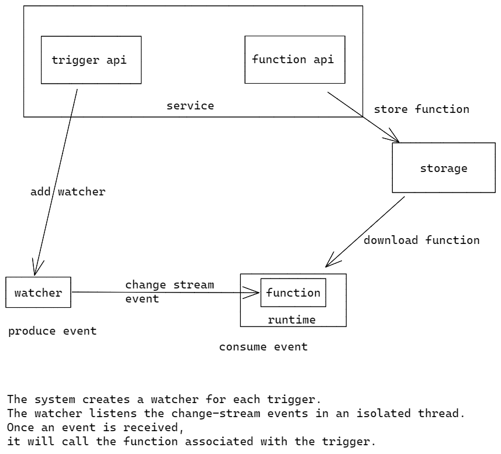

# Core Trigger

- Feature Name: core-trigger-service
- Start Date: 2022-11-07 10:58:27

## Summary

A core trigger service provides triggers that run outside the MongoDB database server. We leverage MongoDB ChangeStream to watch data changes, and provide some way(maybe wasm runtime) to define our own function to handle the change event.

## Motivation

We need a common solution for various requirements following: 1) incremental data synchronization between multiple MongoDB clusters; 2) update cache when data changes; 3) audit of high-risk operations (delete database and delete table);  4) etc. Repeatedly building features for these requirements is a waste of time and resources. We should have a common solution that can be used by all teams.


## Guide-level explanation

Basic architecture:




### Service interface

We would use gRPC as a service interface. Below is the proto definition:

#### trigger.proto

```proto
// The trigger type
enum TriggerType {
  TRIGGER_TYPE_UNKNOWN = 0;
  TRIGGER_TYPE_DATABASE = 1;
  TRIGGER_TYPE_AUTHENTICATION = 2;
  TRIGGER_TYPE_SCHEDULED = 3;
}

// Database operation type
enum DatabaseOperationType {
  DATABASE_OPERATION_TYPE_UNKNOWN = 0;
  DATABASE_OPERATION_TYPE_INSERT = 1;
  DATABASE_OPERATION_TYPE_UPDATE = 2;
  DATABASE_OPERATION_TYPE_REPLACE = 3;
  DATABASE_OPERATION_TYPE_DELETE = 4;
}

// Database trigger configuration
message DatabaseConfig {
  // The uri of the MongoDB data source.
  string data_source = 1;
  // The name of the MongoDB database that contains the watched collection.
  string database = 2;
  // The name of the collection that the trigger watches.
  string collection = 3;
  // A list of one or more database operation types that cause the trigger to
  // fire.
  repeated DatabaseOperationType operation_types = 4;

  // bool full_document = 5;
  // bool full_document_before_change = 6;
  // bool tolerate_resume_errors = 7;
  // bool unordered = 8;
  // string match = 9;
  // string project = 10;
}

// Authentication trigger configuration
message AuthenticationConfig {}

// Scheduled trigger configuration
message ScheduledConfig {}

// Core trigger object. Contains all the information for a trigger if
// ListenResponse op is DELETE, only id will be populated
message Trigger {
  // unique id for the trigger, if put into CreateRequest, id should be
  // empty
  string id = 1;
  // user id for the trigger
  string user_id = 2;
  // The trigger name. This may be at most 64 characters long and can only
  // contain ASCII letters, numbers, underscores, and hyphens.
  string name = 3;
  // The trigger type. The value of this field determines the exact
  // configuration file schema.
  TriggerType trigger_type = 4;
  // A document with fields that map to additional configuration options for
  // the trigger. The exact configuration fields depend on the trigger type
  oneof trigger_config {
    DatabaseConfig database = 5;
    AuthenticationConfig authentication = 6;
    ScheduledConfig scheduled = 7;
  }
  // The Handle Function that the trigger executes whenever it
  // fires.
  string function_id = 8;
  // If false, the trigger will not listen for any events and will not fire
  bool enabled = 9;
}

message CreateRequest { Trigger trigger = 1; }

message CreateResponse { Trigger trigger = 1; }

message UpdateRequest {
  string id = 1;
  string function_id = 2;
}

message UpdateResponse { Trigger trigger = 1; }

message EnableRequest { string id = 1; }

message EnableResponse { Trigger trigger = 1; }

message DisableRequest { string id = 1; }

message DisableResponse { Trigger trigger = 1; }

message DeleteRequest { string id = 1; }

message DeleteResponse { Trigger trigger = 1; }

message GetRequest { string id = 1; }

message GetResponse { Trigger trigger = 1; }

message TriggerQuery {
  string user_id = 1;
  string function_id = 2;
  string trigger_type = 3;
  string data_source = 4;
  string database = 5;
  string collection = 6;
}

message QueryRequest { TriggerQuery query = 1; }

message QueryResponse { Trigger trigger = 1; }

// Trigger service
service TriggerService {
  // create a trigger
  rpc create(CreateRequest) returns (CreateResponse);
  // update the trigger
  rpc update(UpdateRequest) returns (UpdateResponse);
  // enable the trigger
  rpc enable(EnableRequest) returns (EnableResponse);
  // disable the trigger
  rpc disable(DisableRequest) returns (DisableResponse);
  // delete the trigger
  rpc delete (DeleteRequest) returns (DeleteResponse);
  // get the trigger
  rpc get(GetRequest) returns (GetResponse);

  rpc query(QueryRequest) returns (stream Trigger);
}
```

#### function.proto

```proto
syntax = "proto3";
package function;

enum FunctionType {
  FUNCTION_TYPE_UNKNOWN = 0;
  FUNCTION_TYPE_WASM = 1;
}

message Function {
  // unique id for the function, if put into CreateRequest, id should be
  // empty
  string id = 1;
  // user id for the function
  string user_id = 2;
  // The function name. This may be at most 64 characters long and can
  // only contain ASCII letters, numbers, underscores, and hyphens.
  string name = 3;
  // The function type. The value of this field determines the exact func
  // content.
  FunctionType function_type = 4;

  oneof func {
    // wasm binary
    bytes wasm = 5;
  }
}

message CreateRequest { Function function = 1; }

message CreateResponse { Function function = 1; }

message UpdateRequest {
  string id = 1;
  oneof func {
    //
    bytes wasm = 2;
  }
}

message UpdateResponse { Function function = 1; }

message DeleteRequest { string id = 1; }

message DeleteResponse { Function function = 1; }

message GetRequest { string id = 1; }

message GetResponse { Function function = 1; }

message FunctionQuery {
  string user_id = 1;
  string name = 2;
}

message QueryRequest {
  FunctionQuery query = 1;
}

message ExecuteRequest { string id = 1; }

message ExecuteResponse {}

// Function service
service FunctionService {
  // create a function
  rpc create(CreateRequest) returns (CreateResponse);
  // update the function
  rpc update(UpdateRequest) returns (UpdateResponse);
  // delete the function
  rpc delete (DeleteRequest) returns (DeleteResponse);

  rpc get(GetRequest) returns (GetResponse);

  rpc query(QueryRequest) returns (stream Function);
}

```

### Database schema

We use MongoDB to store trigger and function metadata, as well as function files.

#### trigger collection

```json
{
  "_id": "tid",
  "user_id": "uid",
  "name": "tri_1",
  "trigger_type": 1,
  "function_id": "fid",
  "enabled": true,
  "config": {
    "database": {
      "data_source": "mongodb://xx",
      "database": "db_1",
      "collection": "coll_1",
      "operation_types": [1, 2]
    }
  }
}
```

#### function collection

```json
{
  "_id": "fid",
  "user_id": "uid",
  "name": "func_1",
  "function_type": 1,
  "func": {
    "wasm": Binary(Buffer.from("48656c6c6f2c20576f726c6421", "hex"), 0)
  }
}
```

### Core flow


## Reference-level explanation

TBD

## Drawbacks

N/A

## Rationale and alternatives

N/A

## Prior art

N/A

## Unresolved questions
